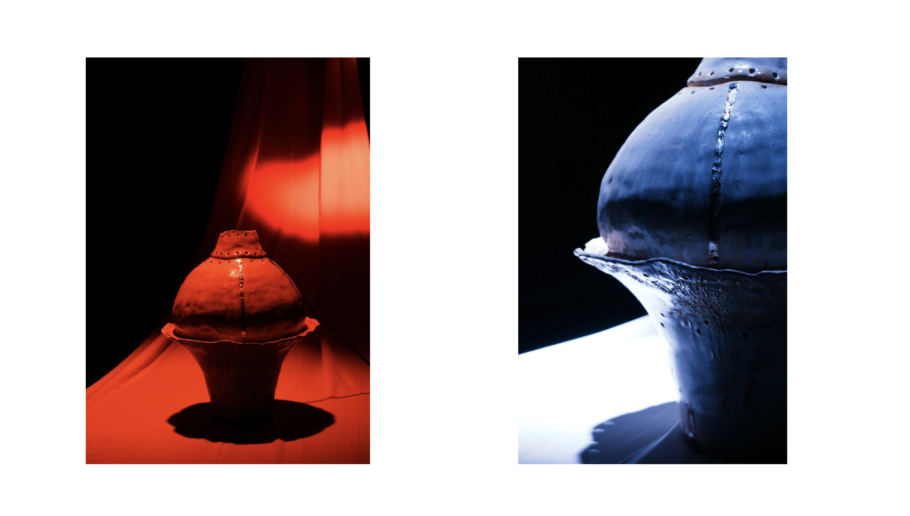

# Ceramic Instrument

A touch-sensitive musical instrument built from fired ceramic, copper tape, and an ESP32 microcontroller. Five copper pads on the ceramic surface map to the notes Do Re Mi Fa So. Touch them to play. Touch them in sequence to transform the sound entirely.



▶ [Watch on YouTube](https://youtu.be/_-lUSP3zuBE)

---

## How It Works

Copper tape is threaded through pre-drilled holes in the fired ceramic, bringing connections from the back of the piece to the playing surface. 
Each pad connects to a capacitive touch pin on an ESP32. The ESP32 sends touch events over USB serial to a browser-based audio engine, which generates sound using the Web Audio API. There are two modes: a warm sine wave and a harsher sawtooth. Playing Do → Re → Mi → Fa → So in sequence switches between them.

---

## Setup

### Hardware

- ESP32 development board (tested with ESP32 DevKit)
- Copper tape threaded through holes in ceramic, soldered to surface pads
- Touch pins used: `T2, T3, T4, T5, T7, T8, T9` (GPIO 2, 15, 13, 12, 27, 33, 32)
- Connect each pad to the corresponding pin; ESP32 ground to the user or ceramic body if needed for stability

### Firmware (PlatformIO)

Open the project in [PlatformIO](https://platformio.org/). The default `platformio.ini` target is the ESP32. Flash the board over USB:

```
pio run --target upload
```

The default touch threshold is `40`. Lower values are more sensitive; higher values require firmer contact. This can be adjusted at runtime from the browser interface without reflashing.

Serial communication runs at **115200 baud**.

**Pin mapping:**

| Pin  | GPIO | Note |
|------|------|------|
| T2   | 2    | Do   |
| T3   | 15   | Re   |
| T4   | 13   | Mi   |
| T5   | 12   | Fa   |
| T7   | 27   | So   |
| T8   | 33   | La   |
| T9   | 32   | Ti   |

### Browser Interface

Open `final1.html` in **Google Chrome** (Web Serial API is Chrome-only). Click **Connect Serial Port** and select the ESP32 from the port list. The interface will begin receiving touch events immediately.

Use the **Touch Threshold** slider to calibrate sensitivity in real time. The value is sent to the ESP32 and takes effect without restarting.

---

## Serial Protocol

| Message        | Direction         | Meaning                          |
|----------------|-------------------|----------------------------------|
| `T1:28`        | ESP32 → browser   | Pin 1 touched, raw value 28      |
| `T1:OFF`       | ESP32 → browser   | Pin 1 released                   |
| `MODE:2`       | ESP32 → browser   | Switched to sawtooth mode        |
| `THRESH:35`    | Browser → ESP32   | Set threshold to 35              |
| `THRESH_ACK:35`| ESP32 → browser   | Threshold confirmed              |

---

## Project Structure

```
├── src/
│   └── main.cpp          # ESP32 firmware (PlatformIO)
├── final1.html # Browser audio interface
└── README.md
```